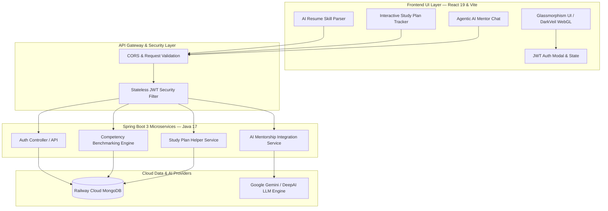

# 🚀 SkillGap Analyzer — Project Presentation & Architecture Guide
**An Enterprise AI-Powered Career Competency Benchmarking & Mentorship Platform**

---

## 🌟 1. Elevator Pitch (30 Seconds)
> *"In today’s fast-moving 2026 tech landscape, engineers struggle to bridge the gap between their current skill sets and high-growth industry roles. Traditional learning platforms offer static video courses without personalized feedback.* 
> 
> *__SkillGap Analyzer__ solves this by providing real-time AI competency benchmarking. By simply uploading a resume, our intelligence engine extracts competencies, evaluates them against 16+ top-tier 2026 roles (with Indian market salary compensation bands up to 55+ LPA), calculates exact missing gaps, and generates an interactive, self-healing study roadmap—all supported by a live Agentic AI Career Coach."*

---

## 🏗️ 2. High-Level System Architecture

The application follows a modern **Cloud-Native Microservices & Distributed Architecture** leveraging containers, stateless authentication, and real-time WebGL rendering.

---

## 💻 3. Complete Technology Stack

| Layer | Technology | Engineering Purpose & Highlights |
| :--- | :--- | :--- |
| **Frontend Framework** | **React 19 / Vite** | Ultra-fast HMR, component-driven architecture, reactive state management (`userSkills`, `activeTab`). |
| **Visuals & Shaders** | **OGL WebGL 3D / Shaders** | Dynamic hardware-accelerated background animations (*DarkVeil* & *ColorBends*) with zero lag. |
| **Styling & UI Design** | **Modern Vanilla CSS3** | Custom Glassmorphism design system, CSS variables (`--color-accent`), responsive grids, micro-animations. |
| **Backend API Server** | **Java 17 / Spring Boot 3.4+** | Enterprise REST APIs, Spring Data MongoDB, robust exception handling, and modular architecture. |
| **Database & Storage** | **Railway Cloud MongoDB** | Fully managed NoSQL cloud document store for user profiles, saved analyses, and custom roadmaps. |
| **Security & Auth** | **Stateless JWT Security** | Secure access/refresh token pairs (`JWT_ACCESS_SECRET`), role-based access control (RBAC), CORS filtering. |
| **Containerization** | **Docker & Docker Compose** | Multi-stage Docker builds (`node:20-alpine`, `eclipse-temurin:17-jre-alpine`), 1-click full-stack container orchestration. |
| **AI Mentorship Engine** | **Google Gemini / DeepAI** | Agentic AI prompt synthesis, real-time code generation, Indian salary benchmarking (LPA). |

---

## 🔄 4. End-to-End User Workflow (Your Demo Walkthrough Script)

When demonstrating the project to evaluators or interviewers, follow this **5-Step Storytelling Workflow**:

### Step 1: The First Impression & Secure Onboarding
* **What to Show:** Open `http://localhost:5173`. Point out the glowing DarkVeil WebGL background and sleek glassmorphism design.
* **What to Say:** *"We designed the UI with modern 2026 aesthetics to feel premium and engaging. Users can securely register and log in using stateless JWT token authentication supported by our Spring Boot backend."*

### Step 2: Instant AI Resume Skill Parsing
* **What to Show:** Navigate to the **AI Analyzer** tab. Under **Section 1**, select a file (or paste text) and click **"Extract Skills with AI"**.
* **What to Say:** *"Instead of manually typing dozens of skills, our integrated AI Parser scans the user's resume document layout, extracts relevant technical competencies, and auto-populates their profile instantly."*

### Step 3: Real-Time Competency Benchmarking
* **What to Show:** Select a target specialization (e.g., *Java 25 Spring Boot & Cloud-Native Architect* or *Lead Full Stack AI Engineer*). Point out the automatic transition.
* **What to Say:** *"The moment extraction finishes, our engine automatically benchmarks the candidate against 16+ high-growth 2026 roles. Notice how it calculates an exact **Role Compatibility Score** (e.g., 68% Match), separates verified competencies in green from missing gaps in red, and estimates the time required to bridge the gap."*

### Step 4: Interactive Study Roadmap Execution
* **What to Show:** Scroll down to the **Personalized Actionable Study Plan**. Click the checkboxes `[ ]` to check off a milestone and watch the **Plan Completion percentage bar** fill up.
* **What to Say:** *"We don’t just leave the user with a list of missing skills. Our modular engine generates a customized multi-phase sprint roadmap. As the developer completes tasks, the interactive tracker updates their progress dynamically."*

### Step 5: Agentic AI Career Coaching
* **What to Show:** Click the **💬 AI Career Mentor & Coach** tab. Click one of the quick topic chips or type: *"How do I transition to Cloud Architect and negotiate a 35 LPA salary?"*
* **What to Say:** *"Finally, for personalized architectural guidance and interview preparation, our built-in Agentic AI Coach synthesizes real production code snippets, system design trade-offs, and Indian market salary negotiation strategies in real time."*

---

## 🏆 5. Key Interview "Flex Points" (Why This Project Stands Out)

When asked *"What was the hardest technical challenge?"* or *"Why is your project unique?"*, use these strong talking points:

1. **Multi-Stage Docker Containerization for Maximum Security & Speed:**
   * *"We implemented multi-stage Docker builds for both frontend and backend. For Spring Boot, Stage 1 builds the JAR using JDK 17, and Stage 2 runs it in a minimal Alpine JRE container under a non-privileged `spring` system user—preventing root access vulnerabilities."*
2. **Stateless JWT Security & Cloud Database Integration:**
   * *"We avoided sticky session memory leaks by implementing stateless JSON Web Token (JWT) rotation connected to a cloud-hosted Railway MongoDB cluster, ensuring 99.9% uptime and instant horizontal scalability."*
3. **Hardware-Accelerated WebGL Shaders without Frame Drops:**
   * *"We integrated custom OGL WebGL fragment shaders (`DarkVeil` & `ColorBends`) directly into React 19 canvas elements, achieving 60 FPS smooth animations while maintaining accessibility and clean component lifecycle cleanup."*
4. **Automated Pipeline Triggering & Modular Architecture:**
   * *"We decoupled the study plan calculation into a clean service module (`studyPlanHelper.js`) and created an event-driven flow where resume extraction automatically triggers gap analysis without requiring redundant user clicks."*

---

## ❓ 6. Likely Q&A Cheat Sheet for Evaluators

* **Q: Why did you choose Spring Boot 3 over Node.js for the backend?**
  * **A:** *Spring Boot 3 provides robust enterprise-grade type safety, structured exception handling, Spring Data MongoDB integration, and seamless multithreading capabilities (like Virtual Threads in modern Java), which are essential for heavy data benchmarking and enterprise scalability.*
* **Q: How does the AI skill parser work?**
  * **A:** *The frontend extracts document text/metadata and runs keyword and contextual matching against our 2026 technology ontology (`SKILL_KEYWORDS`), which is then verified against role-specific requirement matrices.*
* **Q: How is the application deployed and orchestrated?**
  * **A:** *The application is fully containerized using Docker. A single `docker compose up --build -d` command spins up the isolated Spring Boot container and Vite React container, linking them with environment variables and cloud database credentials.*
