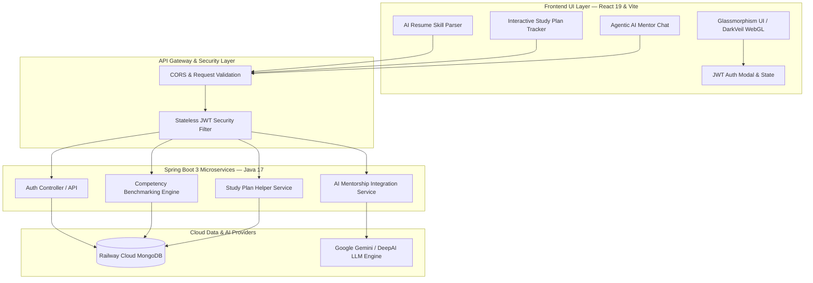

<div align="center">
  <h1>🚀 SkillGap Analyzer</h1>
  <p><strong>An Enterprise AI-Powered Career Competency Benchmarking & Mentorship Platform</strong></p>

  <p>
    <a href="https://authentic-art-production-9e0b.up.railway.app/" target="_blank"></a>
    <a href="https://spring.io/projects/spring-boot" target="_blank"></a>
    <a href="https://react.dev" target="_blank"></a>
    <a href="https://www.mongodb.com/" target="_blank"></a>
    <a href="https://www.docker.com/" target="_blank"></a>
  </p>
</div>

In today's fast-moving tech landscape, engineers struggle to bridge the gap between their current skill sets and high-growth industry roles. Traditional learning platforms offer static video courses without personalized feedback.

**SkillGap Analyzer** solves this by providing real-time AI competency benchmarking. By simply uploading or pasting a resume, our intelligence engine extracts competencies, evaluates them against 16+ top-tier roles, calculates missing gaps, and generates an interactive study roadmap—all supported by a live Agentic AI Career Coach.

---

## 🔗 Live Demo
Access the live deployment on Railway: **[https://authentic-art-production-9e0b.up.railway.app/](https://authentic-art-production-9e0b.up.railway.app/)**

---

## 🌟 Key Features

*   **🔐 Secure Onboarding & Authentication**: Robust registration and login utilizing stateless JWT token pairs (Access & Refresh tokens) backed by Spring Security.
*   **📄 Instant AI Resume Skill Parsing**: Scan resumes or paste candidate bio profiles to dynamically extract core technical skills and populate developer profiles instantly.
*   **📊 Real-Time Competency Benchmarking**: Compare your profile against 16+ high-growth specializations. View an exact **Role Compatibility Score**, color-coded skill alignments (green for verified, red for missing), and estimated preparation time.
*   **🗺️ Interactive Study Roadmaps**: Modular milestone-based roadmap builder with active checkbox tracking and dynamic completion progress bars to visualize your learning path.
*   **💬 Agentic AI Career Coach**: Interactive chat interface powered by Google Gemini/DeepAI to get real-time code examples, system design advice, and compensation benchmarking strategies.

---

## 🏗️ High-Level System Architecture

The application follows a modern **Cloud-Native Microservices & Distributed Architecture** leveraging containers, stateless authentication, and real-time WebGL rendering.



---

## 💻 Tech Stack & Engineering Highlights

| Layer | Technology | Engineering Purpose & Highlights |
| :--- | :--- | :--- |
| **Frontend Framework** | **React 19 / Vite** | Ultra-fast Hot Module Replacement (HMR), component-driven state architecture, reactive state management. |
| **Visuals & Shaders** | **OGL WebGL 3D / Shaders** | Dynamic hardware-accelerated background animations (*DarkVeil* & *ColorBends*) with zero lag. |
| **Styling & UI Design** | **Modern Vanilla CSS3** | Custom Glassmorphism design system, CSS variables (`--color-accent`), responsive grids, micro-animations. |
| **Backend API Server** | **Java 17 / Spring Boot 3.4+** | Enterprise REST APIs, Spring Data MongoDB, robust exception handling, and modular architecture. |
| **Database & Storage** | **Railway Cloud MongoDB** | Fully managed NoSQL cloud document store for user profiles, saved analyses, and custom roadmaps. |
| **Security & Auth** | **Stateless JWT Security** | Secure access/refresh token pairs, role-based access control (RBAC), CORS filtering. |
| **Containerization** | **Docker & Docker Compose** | Multi-stage Docker builds (`node:20-alpine`, `eclipse-temurin:17-jre-alpine`), 1-click full-stack container orchestration. |
| **AI Mentorship Engine** | **Google Gemini / DeepAI** | Agentic AI prompt synthesis, real-time code generation, Indian salary benchmarking (LPA). |

---

## 🛠️ Getting Started & Installation

### Prerequisites
*   [Java Development Kit (JDK) 17+](https://adoptium.net/)
*   [Node.js (v20+) & npm](https://nodejs.org/)
*   [MongoDB](https://www.mongodb.com/try/download/community) (Running locally or cloud instance)
*   [Docker Desktop](https://www.docker.com/products/docker-desktop/) (Optional, for containerized execution)

---

### Quick Start: Docker Compose (Recommended)
You can launch the entire stack with a single command:
```bash
docker-compose up --build
```
This builds and starts:
- **Backend API Server** on `http://localhost:4000`
- **Frontend SPA** on `http://localhost:5173`

---

### Manual Local Setup

#### 1. Clone the Repository
```bash
git clone <your-repository-url>
cd SkillGapAnalyzer
```

#### 2. Backend Setup
1. Navigate to the backend directory:
   ```bash
   cd apps/backend
   ```
2. Copy the sample environment file and configure variables:
   ```bash
   cp .env.example .env
   ```
   Modify `.env` to supply your local or cloud MongoDB connection string:
   ```env
   SERVER_PORT=4000
   MONGODB_URI=mongodb://localhost:27017/skill_gap_analyzer
   CORS_ORIGINS=http://localhost:3000,http://localhost:5173
   JWT_ACCESS_SECRET=your-dev-access-secret-key-goes-here
   JWT_REFRESH_SECRET=your-dev-refresh-secret-key-goes-here
   ```
3. Run the Spring Boot application using Maven:
   ```bash
   ./mvnw spring-boot:run
   ```

#### 3. Frontend Setup
1. Navigate to the frontend directory:
   ```bash
   cd ../frontend
   ```
2. Copy the sample environment file and configure:
   ```bash
   cp .env.example .env
   ```
   Supply your Gemini API Key for the Agentic Career Mentor:
   ```env
   VITE_API_BASE_URL=http://localhost:4000/api/v1
   VITE_GEMINI_API_KEY=your_gemini_api_key_here
   VITE_APP_ENV=development
   VITE_APP_NAME="SkillGap Analyzer"
   ```
3. Install dependencies and run development server:
   ```bash
   npm install
   ```
4. Run the Dev Server:
   ```bash
   npm run dev
   ```
   Open `http://localhost:5173` in your browser.

---

## 🎨 UI/UX Theme
*   **DarkVeil WebGL Theme**: Visually stunning canvas-based backdrop utilizing hardware shaders.
*   **Glassmorphism**: Modern frosted-glass overlays, sleek borders, smooth drop-shadows, and micro-interactions.
*   **Completely Responsive**: Perfect layout optimization across desktops, tablets, and mobile devices.

---

## 📁 Repository Structure
```
SkillGapAnalyzer/
├── apps/
│   ├── backend/          # Spring Boot 3 & Java 17 Microservices API
│   └── frontend/         # React 19 & Vite Web SPA (Glassmorphism & WebGL)
├── docker-compose.yml    # Fullstack multi-container build orchestration
└── PROJECT_PRESENTATION_GUIDE.md
```

---

## 📄 License
This project is open-source and available under the MIT License.
